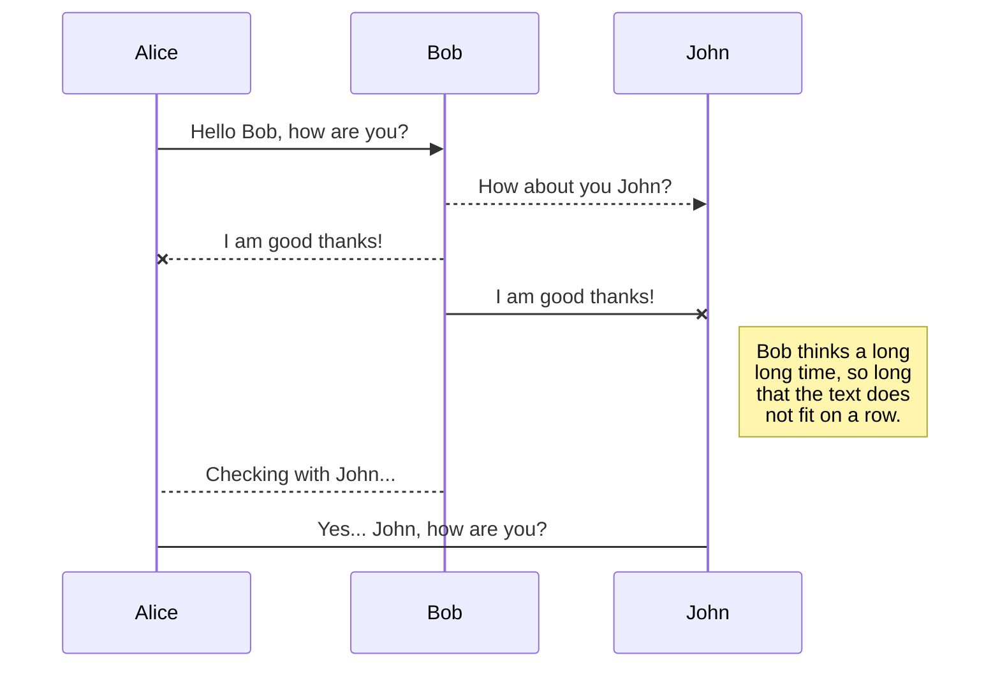
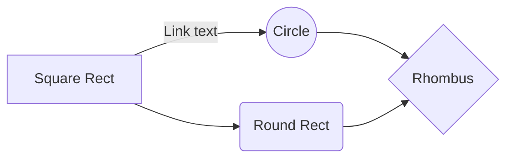

# Welcome to Rover-FP!

Hi! **I'm am your Guide for today **Khalid**. Today I well be Guiding on how to Setup the Rover System.  Start by reading the General Overview of how the System works.

## General Overview

The System Framework is Based on Worker Client Server 

First start with the **Server** the Servers Roll is to Mange and Process the data Between Client and Worker.  
 
>**Full System OverView**

**Server - Rover System**

**Server - Client User System**

## **Robot System🚋**

Input Data Relative to Server:

Raw Data:

-   4 Ultrasonic example : 30 cm
    
-   1 Image Stream example: JPG
    
-   WiFi DP data: 50dp
    
-   WiFi Mac-address: Fx-f4-r4-t4
    
-   Accelerometers data : x-y-z m/s^2
    
-   Time: sec
    

Received Data: from Server:

-   Motor Control: Left Side Wheels
    

-   Speed PWM
    

-   Motor Control: Right Side Wheels
    

-   Speed PWM
    

-   LED : RGB
    
-   Speaker :
    
-   Box Lock/Unlock Servo

## **Server System 🚀**
***Received Data Relative to Clients :***

***JSON Data Rover:***

-   4 Ultrasonic example : 30 cm
    
-   1 Image Stream example: JPG
    
-   WiFi DP data: 50dp
    
-   WiFi Mac-address: Fx-f4-r4-t4
    
-   Accelerometers data : x-y-z m/s^2
    
-   Time: sec
    

***JSON Data Website:***

-   Motor Action - Admin User
    
-   Start Location
    
-   End Location
    
-   Request Rover
    
-   Login Request
    
-   Sign Up Request
    
-   Buy Item Request
    

JSON Data Computer Vision Worker:

-   Object xywh data
    

Processing : Processed by server

Rover Side Server

Data Processing

-   Ultrasonic for each sensor
    

-   add up to 20x /20
    
-   Output: average for 20 cycles
    

-   Image Stream
    

-   Object detection Processed by Computer Vision Worker
    
-   Output: xywh data of Object like Person
    

-   Wifi Data
    

-   Fill in an Array With Room Number to Mac-Address
    
-   Output: Room Number Linked to Mac Address
    

-   Accelerometers data
    

-   Take Integral of Acceleration / time = Velocity
    
-   d = vt
    
-   Output: Distance , Velocity
    

Path Finding

Object avoidance

Safety System

Path Training

Website Side Server

Login

SignUp

Save

  

Output Data: from Server:

***Rover Output:***

-   Motor Control: Left Side Wheels
    

-   Speed PWM
    

-   Motor Control: Right Side Wheels
    

-   Speed PWM
    

-   LED : RGB
    
-   Speaker :
    
-   Box Lock/Unlock Servo
    

User Output:

-   Sensors Live Data
    
-   Cam Live Data
    
-   Robot Location
    
-   Stats

## **User System ☕**
HTML Website

***Pages***

-   Home
    

Sub Sections

Live

Current Users

-   About
    

Description

-   Order Coffee
    

Items

Summon

-   Login
    

User Page

-   Cart
    
-   Agenda
    
-   Summon
    

-   Map
    
-   Live Cam
    
-   Live Sensor
    
-   Time
    
-   Location
    

-   Past Orders
    
-   Settings
    

Admin Page

-   Motor Control
    
-   Live Cam VIew
    
-   Live Sensor Data
    
-   Path Finder
    
-   Map
    

-   Anncoments
    

Posts

-   Live Chat
    

Chat Chat

Games

-   SignUp
    

  
  
  
  

  
  
  
  

Task Left TO DO

  

Hardwear

-Big Rover Cad Model

-Big Rover Wire Semantic

-Build Big Rover

Softwear

Rover

-   Setup SD Card
    
-   Setup Lib
    
-   Set Program Rover Code
    

Server Rover Side

-   Camera Vision API
    

-   Change Protocol
    

-   Ultra Sensor API
    

-   Data Processing
    

-   Wifi API
    

-   Speed Up
    
-   Mac Address Lookup
    

-   Accelmotre API
    
-   Motor API
    
-   Receive API
    
-   Process API
    
-   Map Class
    
-   Path Saver
    
-   AI Class
    
-   Box API
    
-   Speak API

## **End Goal**

Features of Robot System

-Call for pick up of textbooks

Lunch the web app.

Login as your Name

Press Request Item Delivery

App Checks if Robot is Available

App pings you nearest location via wifi Access Points.

App Makes Connection to Robot

Robot Checks it nearest location via wifi Access Point.

App Makes Best Route

Robot Makes it way safely to user View Vision and ultraSonic

App Sends Robot Arrives at Door

User Inserts Items in Basket

User Press Confirm

Robot Makes it way to Delivery Location

End User Press Confirm

Robot Returns back to home “Room 201”

-Call for pick up from classroom to classroom

Lunch the web app.

Login as your Name

Press Request a Ride

App Checks if Robot is Available

App pings you nearest location via wifi Access Points.

App Makes Connection to Robot

Robot Checks it nearest location via wifi Access Point.

App Makes Best Route

Robot Makes it way safely to user Via Vision and ultraSonic

App Sends Robot Arrives at Door

User Says were he wants to go

Robot Makes it way to Delivery Location

User Press Confirm

Robot Returns back to home “Room 201”

  
  
  
  
  

-Call for Pick up of tim Horton coffee Cash system

Lunch the web app.

Login as your Name

User PIcks what Coffee they need

Robot Pick your Money

Might Hook up Live Mic

|i|j  |
|--|--|
|  k|  |

## SmartyPants

SmartyPants converts ASCII punctuation characters into "smart" typographic punctuation HTML entities. For example:

|                |ASCII                          |HTML                         |
|----------------|-------------------------------|-----------------------------|
|Single backticks|`'Isn't this fun?'`            |'Isn't this fun?'            |
|Quotes          |`"Isn't this fun?"`            |"Isn't this fun?"            |
|Dashes          |`-- is en-dash, --- is em-dash`|-- is en-dash, --- is em-dash|

## KaTeX

You can render LaTeX mathematical expressions using [KaTeX](https://khan.github.io/KaTeX/):

The *Gamma function* satisfying $\Gamma(n) = (n-1)!\quad\forall n\in\mathbb N$ is via the Euler integral

$$
\Gamma(z) = \int_0^\infty t^{z-1}e^{-t}dt\,.
$$

> You can find more information about **LaTeX** mathematical expressions [here](http://meta.math.stackexchange.com/questions/5020/mathjax-basic-tutorial-and-quick-reference).

## UML diagrams

You can render UML diagrams using [Mermaid](https://mermaidjs.github.io/). For example, this will produce a sequence diagram:

And this will produce a flow chart:

